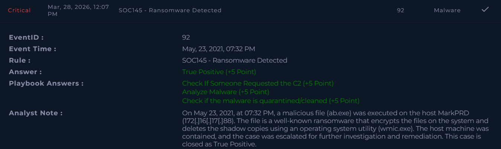

### Alert Information 
```
EventID: 92

Event Time: May, 23, 2021, 07:32 PM

Rule: SOC145 - Ransomware Detected

Level: Security Analyst

Source Address: 172.16.17.88

Source Hostname: MarkPRD

File Name: ab.exe

File Hash: 0b486fe0503524cfe4726a4022fa6a68

File Size: 775.50 Kb

Device Action: Allowed

File (Password:infected): https://download.cyberlearn.academy/download/download?url=https://files-ld.s3.us-east-2.amazonaws.com/0b486fe0503524cfe4726a4022fa6a68.zip
(This is an infected file do not download and run it on your own machine!)
```
### Analyst Note:

> On May 23, 2021, at 07:32 PM, a malicious file (ab.exe) was executed on the host MarkPRD (172[.]16[.]17[.]88).
The file is a well-known ransomware that encrypts the files on the system and deletes the shadow copies using an operating system utility (wmic.exe).
The host machine was contained, and the case was escalated for further investigation and remediation. This case is closed as True Positive.



