## Alert Information 
```
EventID: 201

Event Time: 2023-11-21T12:24:00+03:00

Rule: SOC239 - Remote Code Execution Detected in Splunk Enterprise

Role: Security Analyst

Alert Type: Unauthorized Access

MITRE ATT&CK: T1190, T1199, T1059.004, T1136, T1210

Hostname: Splunk Enterprise

Device Action: Allowed

Requested URL: http://18.219.80.54:8000/en-US/splunkd/__upload/indexing/preview?output_mode=json&props.NO_BINARY_CHECK=1&input.path=shell.xsl

Source IP Address: 180.101.88.240

Trigger File Path: /opt/splunk/var/run/splunk/dispatch/1700556926.3/shell.xsl

HTTP Request Method: POST

Alert Trigger Reason: Detected a malicious XSLT upload in Splunk Enterprise with the potential to trigger remote code execution.

Destination IP Address: 172.16.20.13  
```

## Investigation
Let's have a look at the alert and understand what's happening.
- An alert was triggered for a potential Remote Code Execution (RCE) attempt against the Splunk Enterprise server.

### Suspicious Request Analysis
> hxxp[://]18[.]219[.]80[.]54:8000/en-US/splunkd/__upload/indexing/preview?output_mode=json&props[.]NO_BINARY_CHECK=1&input[.]path=shell[.]xsl
- Endpoint: ***/en-US/splunkd/__upload/indexing/preview***
  - This is Splunk’s legitimate “Upload Data / Preview” endpoint used to preview files before indexing.
- Key Parameters:
  - output_mode=json
  - props.NO_BINARY_CHECK=1 → Disables Splunk’s binary file check, allowing potentially malicious content to be accepted.
  - input.path=shell.xsl → Indicates the uploaded file is named shell.xsl.

This combination is highly suspicious and matches the known exploitation pattern for ***CVE-2023-46214*** (Authenticated XSLT Injection leading to Remote Code Execution).

The file ***shell.xsl*** was uploaded to the directory: ***/opt/splunk/var/run/splunk/dispatch/1700556926.3/***.  

### What is CVE-2023-46214?
- CVE-2023-46214 is an authenticated Remote Code Execution (RCE) vulnerability in Splunk Enterprise. It is caused by insufficient sanitization of user-supplied XSLT files.

#### Exploitation steps:

1. Attacker authenticates to Splunk with valid credentials.
2. Uploads a malicious XSLT file (e.g. shell.xsl) via the /splunkd/__upload/indexing/preview endpoint.
3. Triggers XSLT processing on the uploaded file.
4. The malicious XSLT writes and executes a reverse shell script on the server, giving the attacker code execution.

### Playbook
We'll use the playbook to continue our investigation.
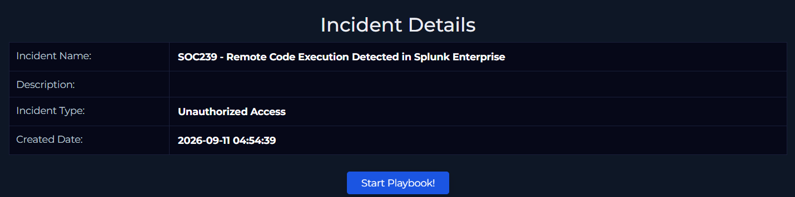


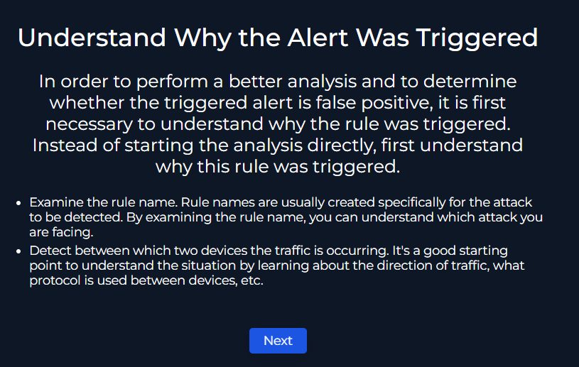
- We now know that this vulnerability is ***CVE-2023-46214***. We also know how it works and it's exploitation steps.  
- We also have the IP address of the threat actor. Let's look it up and do some research on it.

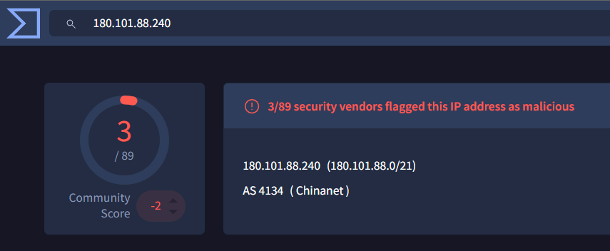  
- 3 out of 89 marked it as malicious.  

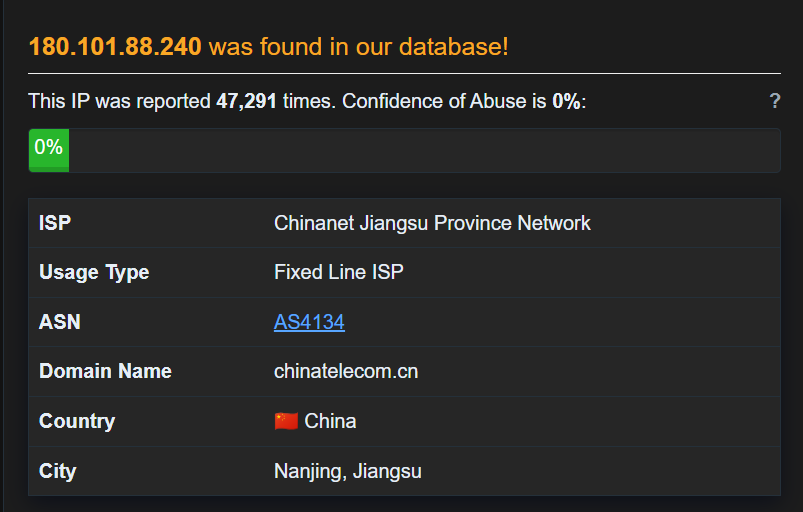  
-  Confidence of abuse is 0%, but being reported 47,291 is a little suspicious.  

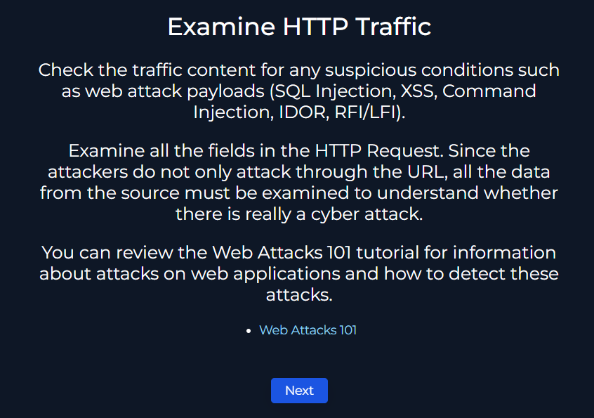  

#### Let's look at the logs and examine the traffic between the suspicious ip address and our Splunk server.

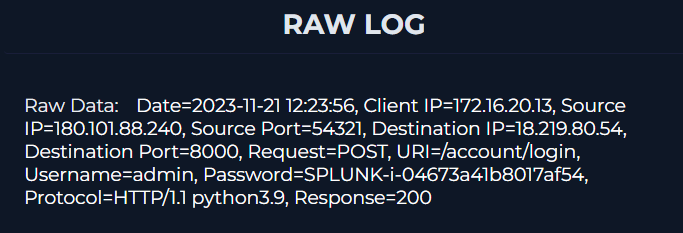  
-  The IP address authenticated to the Splunk server as the admin user.  

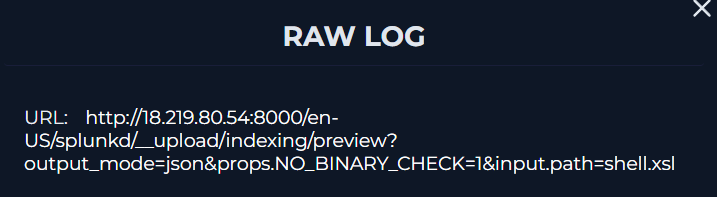  
-  The ***shell.xsl*** file was uploaded.  

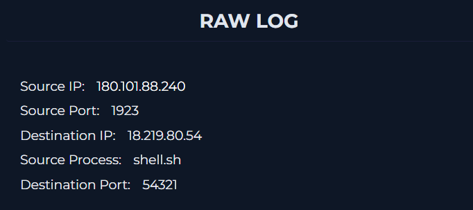  
-  The reverse shell file was executed.   

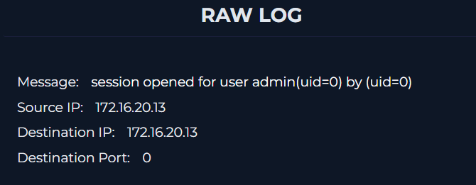  
-  An admin session was established immediately afterward, providing further evidence of successful reverse shell execution.  

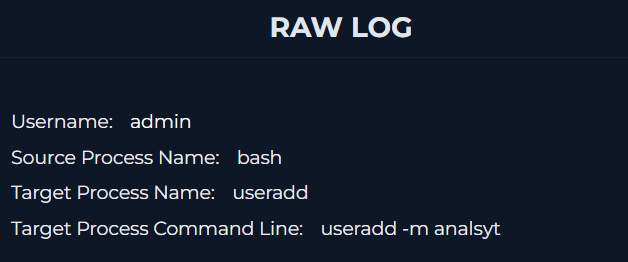  
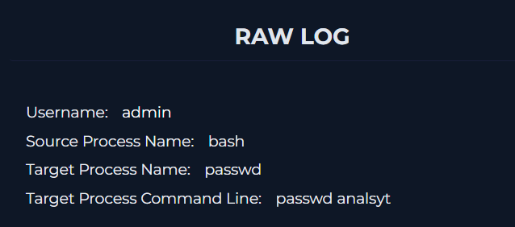  
-  We can also see that the attacker created the user ***"analsyt"***, likely as a **persistence** mechanism.  


- The traffic is confirmed to be malicious.  

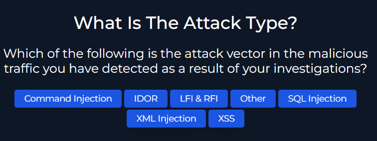
- It's an XML injection vulnerability.  

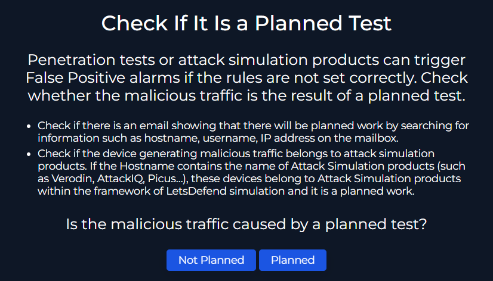
- There are no emails that mention whether this is a planned test or not, also the external IP address's reputation is suspicious.  


- The attacker's IP address is external and the Splunk server is inside the company's network.  

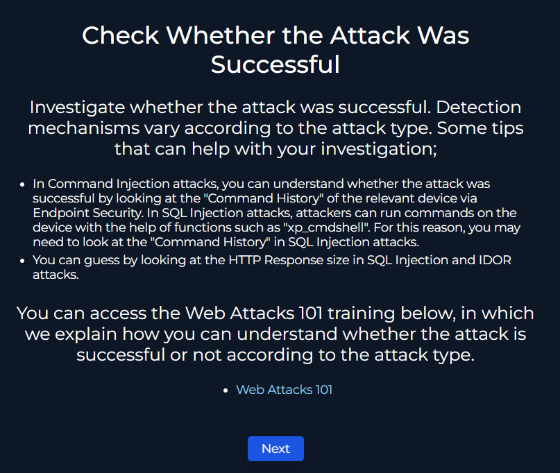
- The attack was confirmed to be successful.  

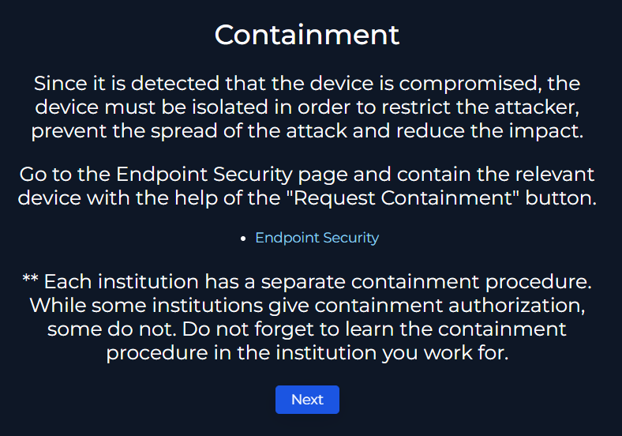
- Let's head to the EDR solution to contain the device and continue investigating.  
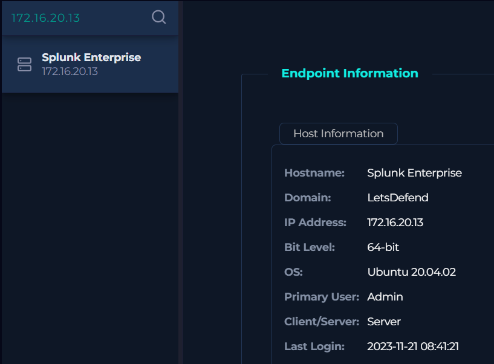  


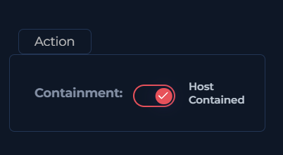  
- The server is now contained and isolated.  

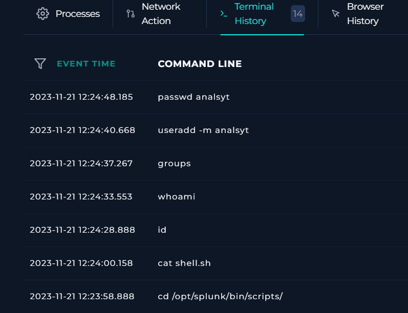 
- In the terminal history we can see the attacker's enumeration, we can also see the ***"analsyt"*** user being added.  

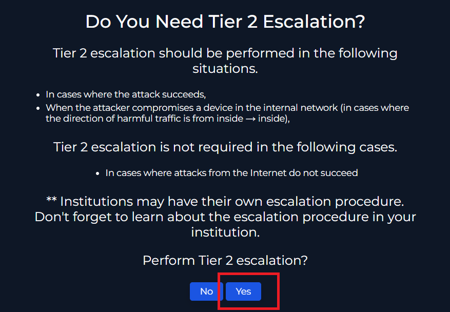  
- Escalation is required in this case because the server was compromised.  

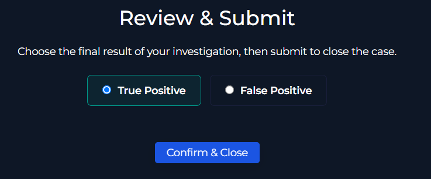  
- This is a True Positive.  

### Key Findings

- The attacker (180[.]101[.]88[.]240) successfully authenticated as the **'admin'** user.
- A malicious XSLT file (**"shell.xsl"**) was uploaded.
- A reverse shell was successfully executed.
- Persistence was established by creating a new local user account: **"analsyt"**.
- The attack originated from an external IP address targeting an internal Splunk server.


## Artifacts:

| Value        | Comment           | Type  |
| ------------- |:-------------:| -----:|
| 180[.]101[.]88[.]240      | 	Attacker's IP Address | IP Address |
| 	172[.]16[.]20[.]13 | Splunk Enterprise's local IP Address     |    IP Address |
| 	18[.]219[.]80[.]54 | Splunk Enterprise's public IP Address     |    IP Address |
| hxxp://18[.]219[.]80[.]54:8000/en-US/splunkd/__upload/indexing/preview?output_mode=json&props.NO_BINARY_CHECK=1&input[.]path=shell[.]xsl | 	Exploit URL     |    	URL Address |
| 	shell[.]xsl     |    Malicious XSLT file | File |
| 	analsyt     |    Persistence user account created by attacker | User Account |

## Analyst Note:

> On Nov 21, 2023, at 12:24:00 PM, an alert was triggered for a remote code execution (RCE) attempt against a Splunk Enterprise server. Investigation confirmed that an external threat actor successfully authenticated as the admin user, uploaded a malicious XSLT file (shell.xsl), achieved code execution, and established persistence by creating a new local user account. The server was contained and the case was escalated for further investigation and remediation. This case is closed as a True Positive.

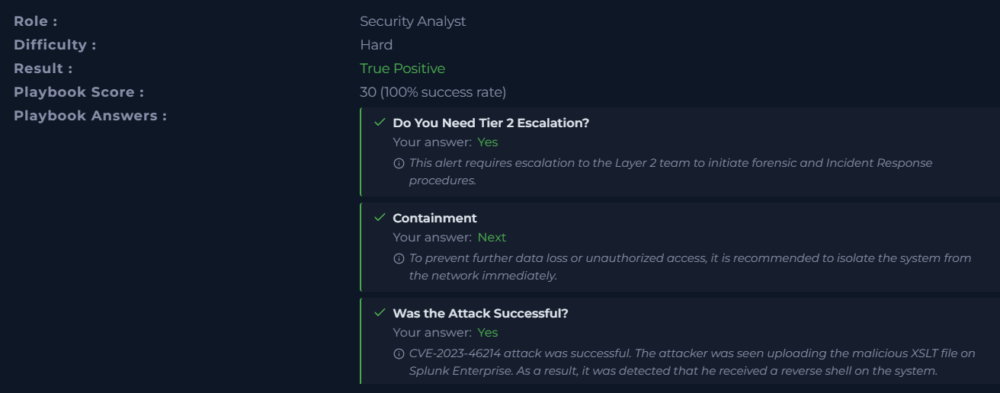
