## Alert Information 
```
Event ID: 314

Event Time: February 4, 2025 at 4:18:08 PM

Rule: SOC336 - Windows OLE Zero-Click RCE Exploitation Detected (CVE-2025-21298)

Role: Security Analyst

Alert Type: Malware

MITRE ATT&CK: T1566 T1059.001 T1574.002

Attachment: mail.rtf

SMTP Address: 84.38.130.118

Device Action: Allowed

E-mail Subject: Important: Action Required for Upcoming Project Deadline

Source Address: projectmanagement@pm.me

Trigger Reason: Malicious RTF attachment identified with known CVE-2025-21298 exploit pattern.

Attachment Hash: df993d037cdb77a435d6993a37e7750dbbb16b2df64916499845b56aa9194184

Destination Address: Austin@letsdefend.io  
```

## Investigation
Let's first read the alert and understand what's happening. It looks like a phishing email sent by ***projectmanagement@pm[.]me*** to ***Austin@letsdefend[.]io*** containing an attachment ***"mail.rtf"*** that is possibly used to exploit ***CVE-2025-21298*** in Windows. The action was allowed, so we need to determine whether the malicious attachment was processed and whether exploitation occurred.

### What is CVE-2025-21298?
- CVE-2025-21298 is a zero-click vulnerability in Windows OLE, a technology that enables embedding and linking to documents and other objects.
- Attackers send a specially crafted email containing a malicious Rich Text Format (RTF) document with a weaponized OLE object.
- The zero-click nature of this vulnerability means that exploitation can occur without any user interaction beyond opening or previewing the malicious email, inherently increasing its severity.

***This means that the victim just has to open the email in order for the exploit to work. This is super critical so we need to act quick!***


### Playbook
Let's start using our playbook.  
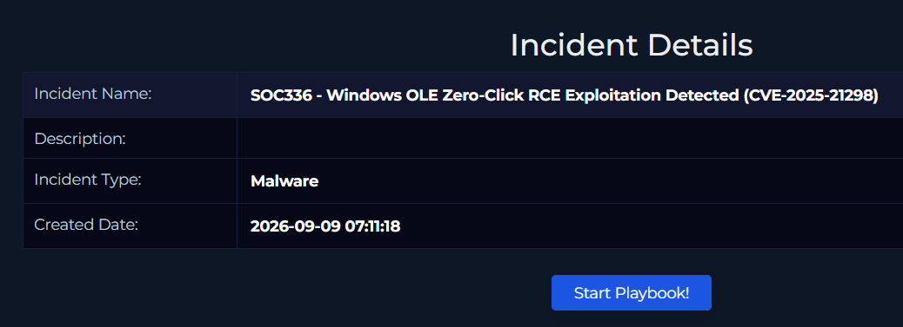

First, we'll examine the email and extract the relevant artifacts.  
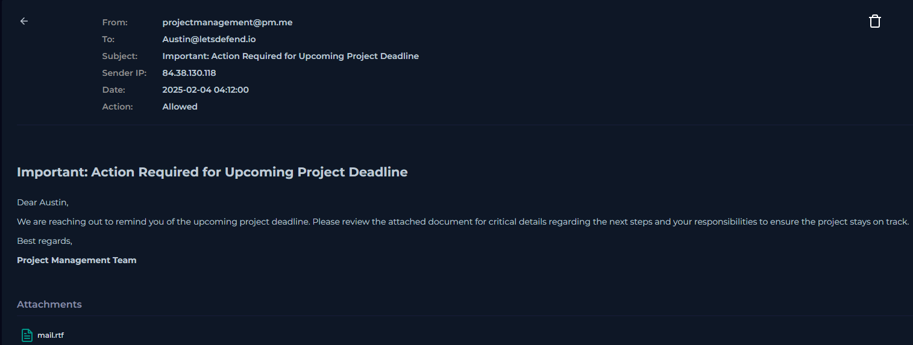

1. Sender's email: ***projectmanagement@pm[.]me***  
2. SMTP address: ***84[.]38[.]130[.]118***
3. Attachment and hash: ***mail.rtf*** - ***df993d037cdb77a435d6993a37e7750dbbb16b2df64916499845b56aa9194184***

It's time to use Threat Intelligence to figure out whether these artifacts are malicious or not.   
1. The sender's email is a legitimate Proton email address (doesn't mean it's not malicious)

2. The SMTP address however is flagged 7 out of 89 times as malicious, which indicates high risk.  
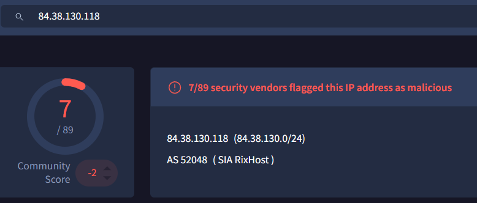

3. The attachment is definitely malicious. It's flagged 29 times as malicious and also flagged as CVE-2025-21298 exploit.  
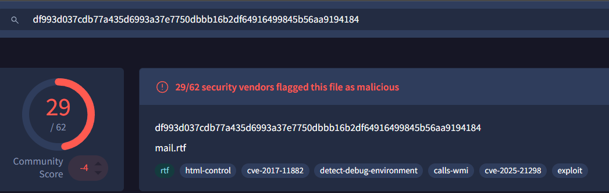

Also by looking at LetsDefend built-in Threat Intel tool the SMTP address and the attachment are flagged as malicious.   
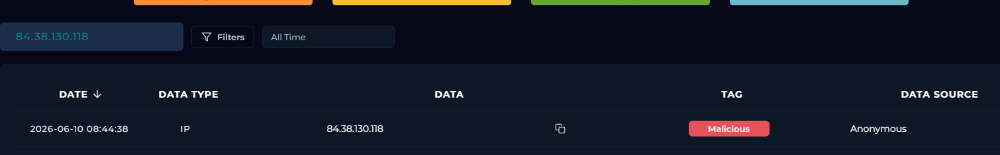
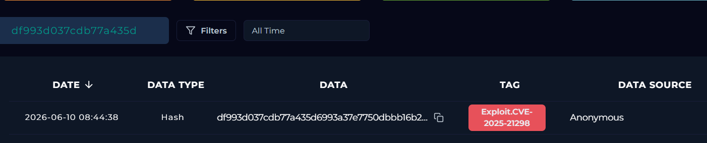

***Now we've made sure the email is definitely a malicious phishing email, let's see if the user opened the email and the exploit was triggered.***

#### We'll take a look at the victim's machine using the EDR solution.
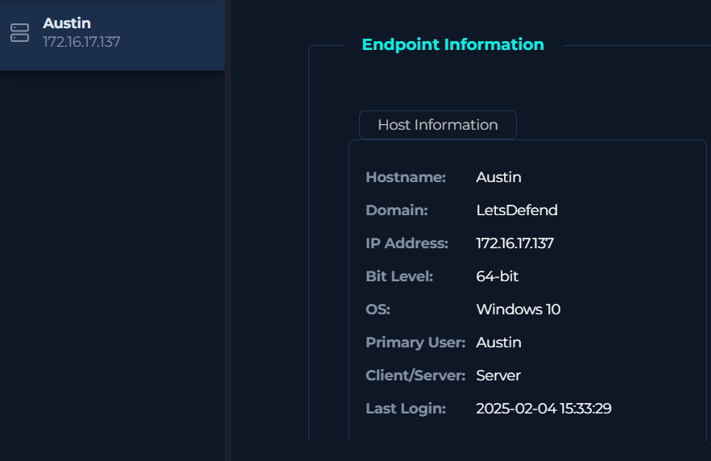

- The browser history appeared normal, with no suspicious activity observed.  
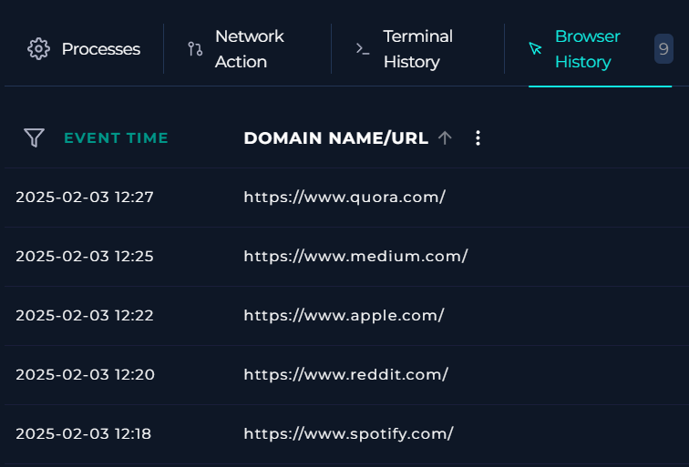

- Looking at the terminal history we see a suspicious command requesting the malicious IP address we saw earlier ***(84[.]38[.]130[.]118)***. This indicates that the host communicated with the identified malicious infrastructure.  
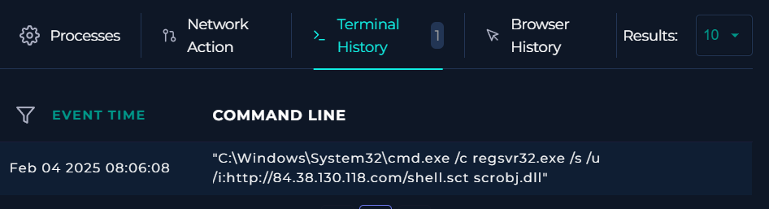

- We have to isolate and contain the host to prevent further damage.  
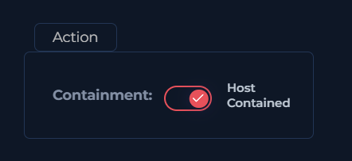

- We can see in the Processes section the Outlook process spawned a cmd process which spawned a regsvr32 process to download the malicious script ***shell.sct*** from the remote address ***hxxp:[//]84[.]38[.]130[.]118[.]com/shell[.]sct.
- Process chain: **Outlook → cmd.exe → regsvr32.exe → shell.sct**.  
  
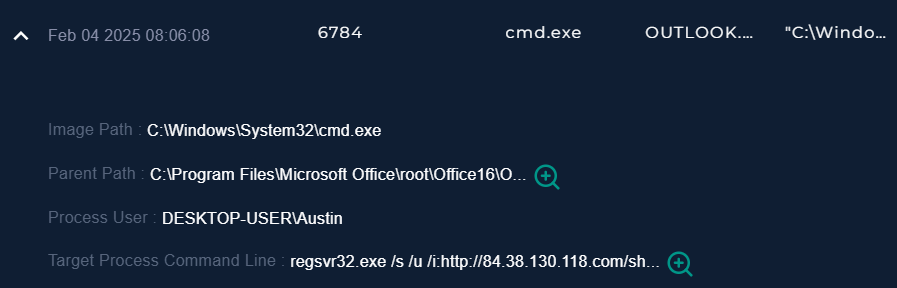
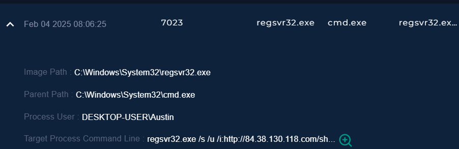

#### Let's now answer the Playbook questions.

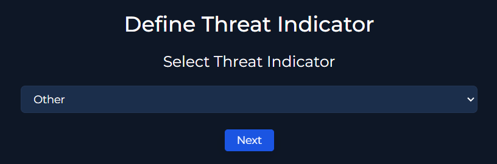

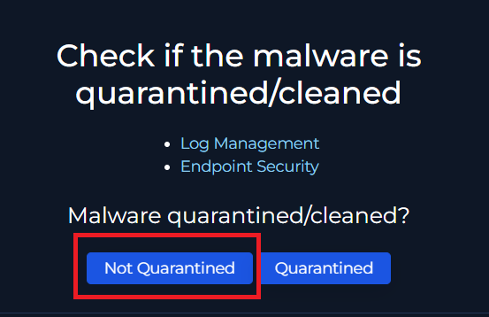
- It's not quarantined.

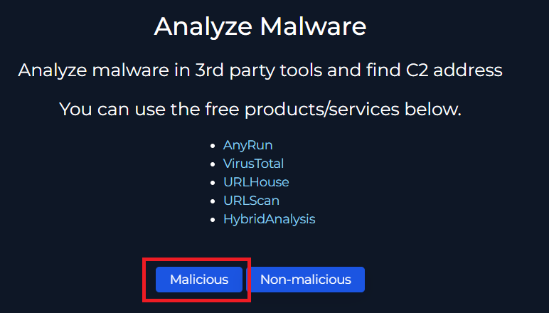
- It's definitely malicious.

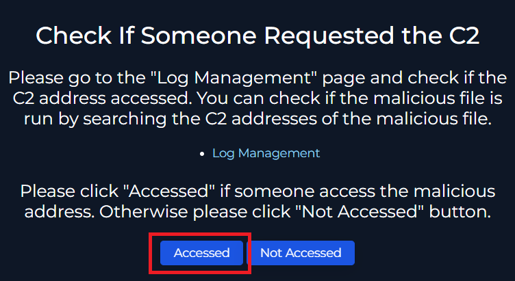
- The C2 server was requested and accessed.

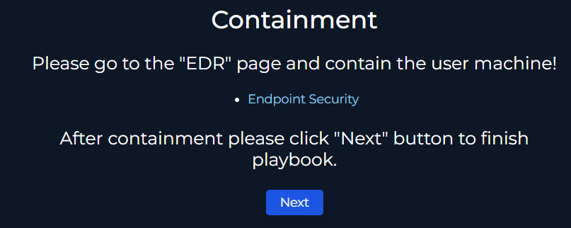
- We already did it.

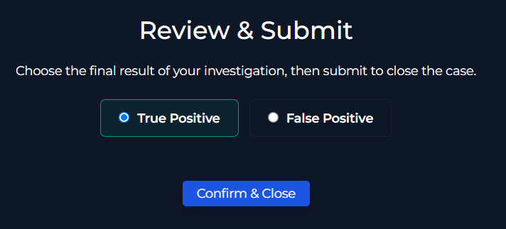
- True Positive.

## Artifacts:

| Value        | Comment           | Type  |
| ------------- |:-------------:| -----:|
| 84[.]38[.]130[.]118      | 	C&C IP Address | IP Address |
| 	projectmanagement@pm[.]me | Sender's Email     |    E-mail Sender |
| 	hxxp[://]84[.]38[.]130[.]118[.]com/shell[.]sct | Malicious URL    |    URL Address |
| 961027d29dda725b8117571a6a6ca1d5 | 	Attachment Hash     |    	MD5 Hash |
| df993d037cdb77a435d6993a37e7750dbbb16b2df64916499845b56aa9194184 | 	Attachment Hash     |    	SHA256 Hash |


## Analyst Note:

> On February 4, 2025 at 16:18:08 UTC+03:00, an email was sent to ***austin@letsdefend[.]io*** from ***projectmanagement@pm[.]me***. The email contained a malicious attachment exploiting CVE-2025-21298. The malicious attachment was processed, and the endpoint activity confirmed a successful exploitation attempt. The affected device was contained and the case was escalated for further investigation. The case is classified as a True Positive.

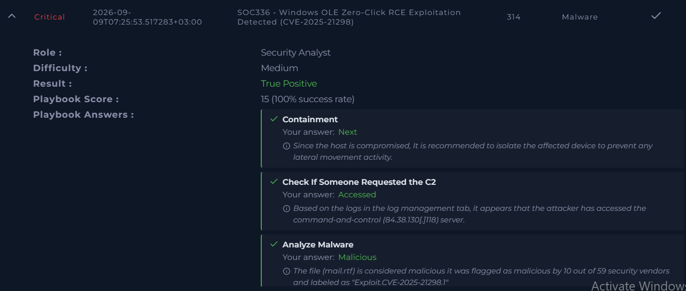
