## Alert Information 
```
EventID: 316

Event Time: Mar, 13, 2025, 09:44 AM

Rule: SOC338 - Lumma Stealer - DLL Side-Loading via Click Fix Phishing

Level: Security Analyst

SMTP Address: 132.232.40.201

Source Address: update@windows-update.site

Destination Address: dylan@letsdefend.io

E-mail Subject: Upgrade your system to Windows 11 Pro for FREE

Device Action: Allowed

Trigger Reason: Redirected site contains a click fix type script for Lumma Stealer distribution.
```
## Investigation

First we need to observe the alert and understand what it is.
It looks like this is a phishing email sent by ***update@windows-update[.]site*** to user ***dylan@letsdefend[.]io*** claiming a "free windows 11 pro update". It also looks like this email contains an attachment that could be a lumma stealer malware.

### What is a Lumma Stealer?
It's an info-stealer malware that targets Windows systems to steal browser credentials, cryptocurrency wallets, and 2FA codes.

### Playbook
LetsDefend provide us with a playbook to follow and investigate the alert correctly.
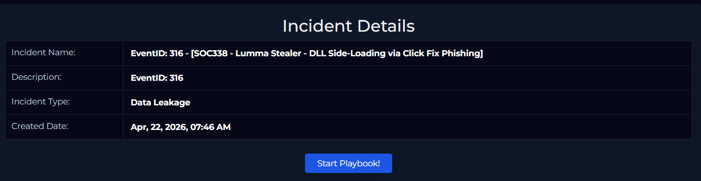


When you receive an alert about a phishing email there's multiple things to make note of.
1. Sender's E-mail & Domain
2. Recipient Address
3. Are there any attachments? If yes, are they malicious or not?

So let's take a look at the email and figure out if it's suspicious or not.

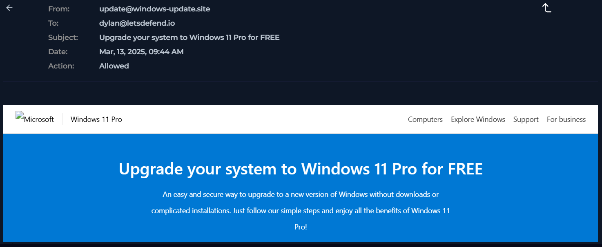

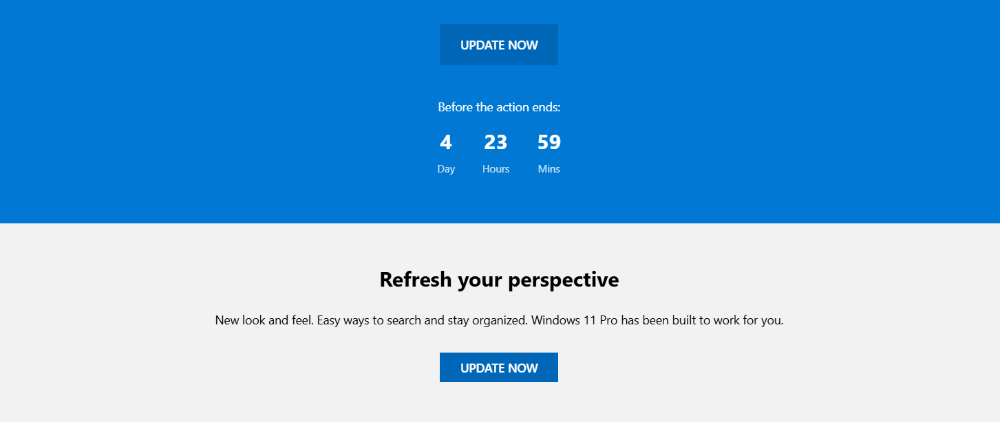

So it looks like the sender's SMTP domain is ***windows-update[.]site***. It also has a link-attachment that directs the user to ***www[.]windows-update[.]site*** . Let's check it out on VirusTotal.

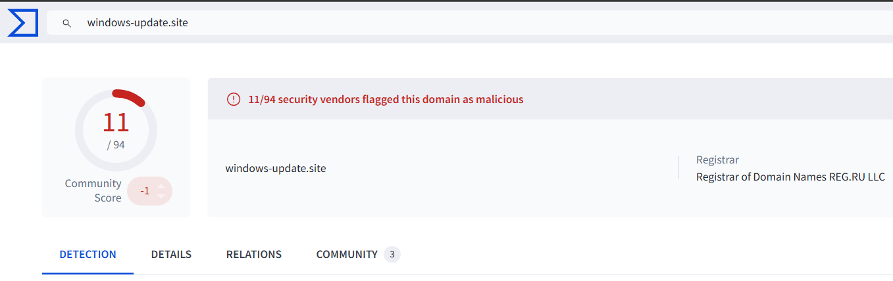

11 out of 94 security vendors flagged it as malicious, a huge red flag!

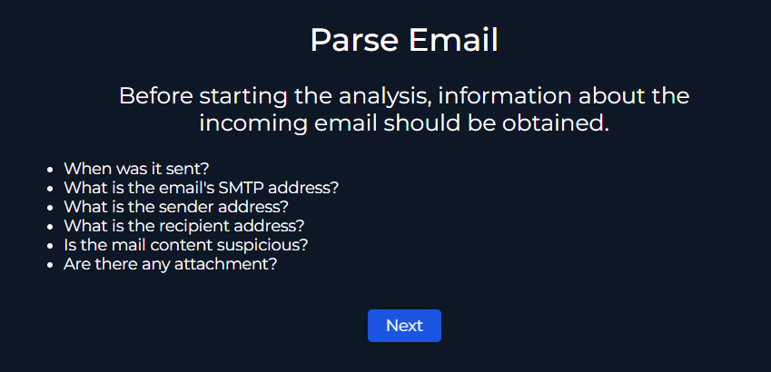

Now we have this information let's answer these questions.

- When was it sent?
  > Mar, 13, 2025, 09:44 AM
- What is the email's SMTP address?
  > 132[.]232[.]40[.]201
- What is the sender address?
  > update@windows-update[.]site
- What is the recipient address?
  > dylan@letsdefend[.]io
- Is the mail content suspicious?
  > Yes
- Are there any attachment?
  > Yes

Let's continue the playbook!

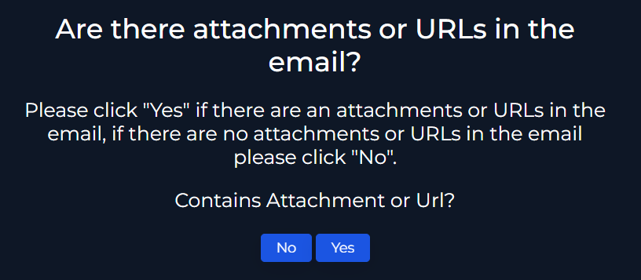

We confirmed that the email has a link-attachment to a malicious website.

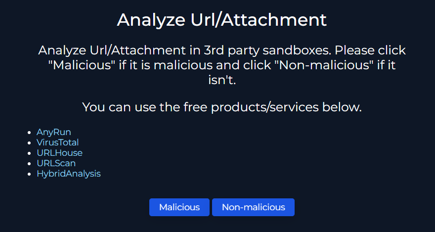

We analyzed it on VirusTotal and it was confirmed to be malicious.

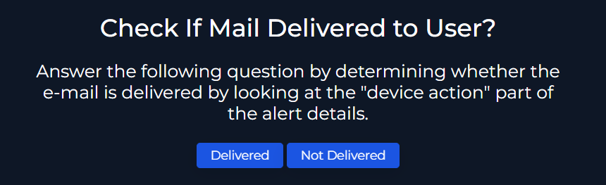

The mail was indeed delivered to the user as we can see in the [Alert Information Section](#alert-information).


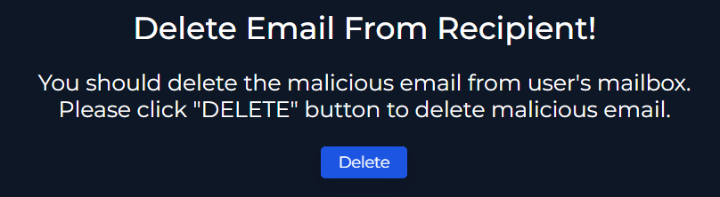

We can simply delete the email by navigating to the email security solution, find the email and press the delete button on the right.

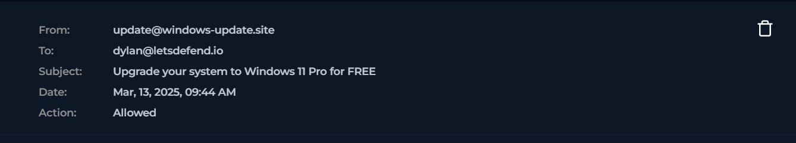

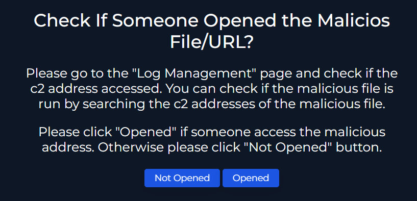

Let's look at the endpoint security solution to figure out whether the malicious link was clicked/opened and what suspicious processes are running.

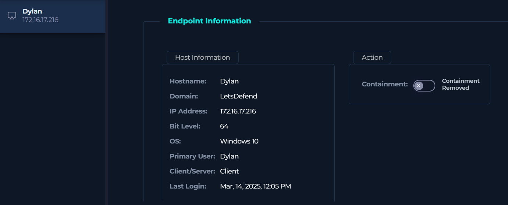

Let's take a look at the browser history.

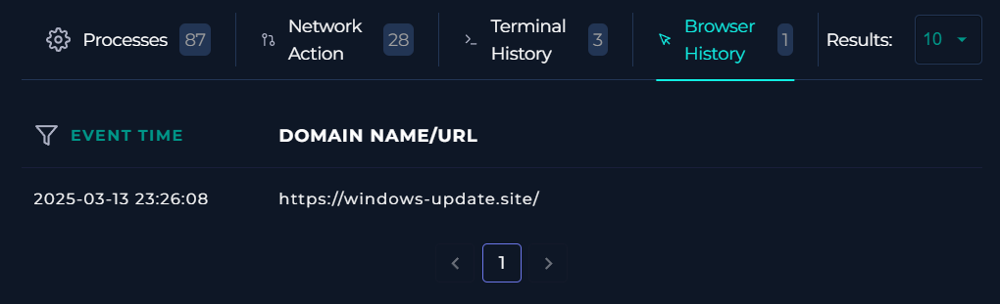

The link was in fact clicked.

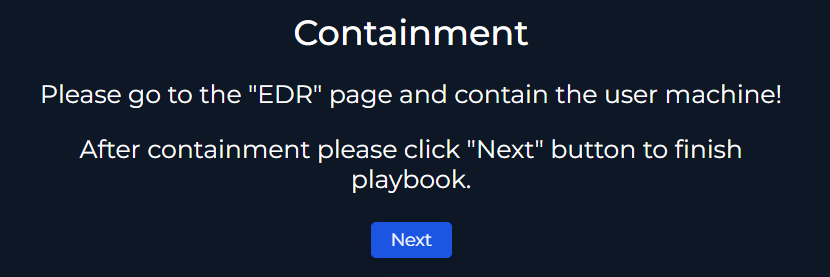

Now we have to isolate the host by pressing the Containment button.

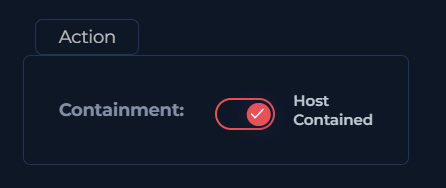

Let's investigate further and look at the terminal history and processes running to check for any suspicious activity.

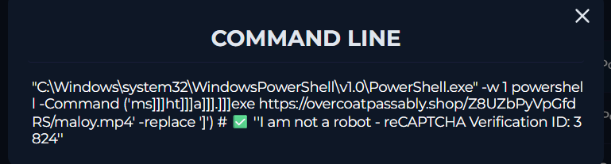

Looking at the terminal history, the micrsoft utility PowerShell was used to download a file from the url ***hxxps[://]overcoatpassably[.]shop/Z8UZbPyVpGfdRS/maloy[.]mp4*** and that file was executed by another utility(mshta.exe) which allows execution of HTML applications.

Let's take a look at the Processes section for more details.

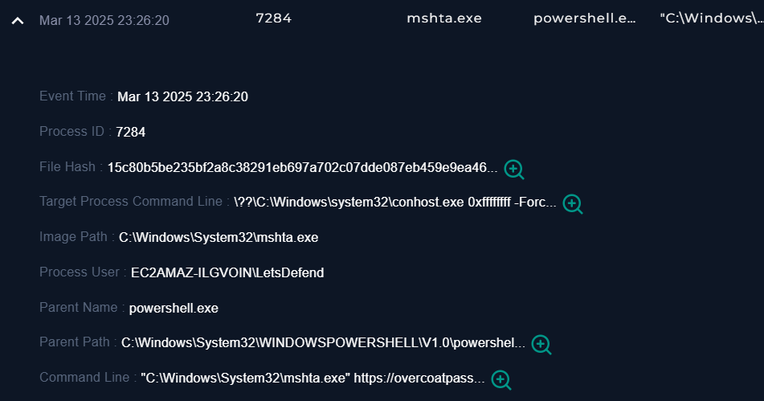

Now we have the file hash and the URL it was downloaded from. Let's check both on VirusTotal.

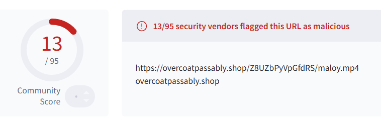

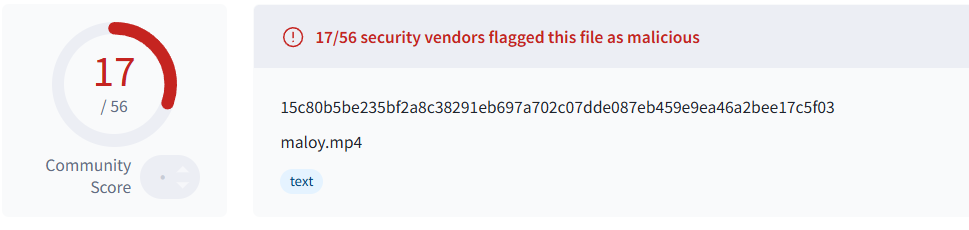

Checking the file URL and hash on VirusTotal it was confirmed that the file is malicious and it's in fact a Lumma Stealer.

## Artifacts:

| Value        | Comment           | Type  |
| ------------- |:-------------:| -----:|
| 132[.]232[.]40[.]201      | Attacker's SMTP address | IP Address |
| windows-update[.]site      | 	Sender's domain address      |   E-mail Domain |
| update@windows-update[.]site | Sender's Email     |    E-mail Sender |
| hxxps[://]overcoatpassably[.]shop/Z8UZbPyVpGfdRS/maloy[.]mp4 | Malicious file URL    |    URL Address |
| fa93130bcd584f7349fb6399b2092b0f | 	Malicious file hash     |    	MD5 Hash |

## Analyst Note:

> On Mar 13, 2025, at 09:44 AM, an email with the source address ***"update@windows-update[.]site"*** and IP address of ***"132[.]232[.]40[.]201"*** sent an email to user ***dylan@letsdefend[.]io*** claiming a "free windows 11 update". The email contained a malicious URL that has a downloadable malware(Lumma Stealer) which the user has downloaded and executed on his device. The host machine was contained, and the case was escalated for further investigation and remediation. This case is closed as True Positive.


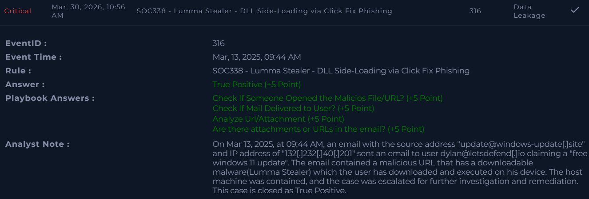
